# AI智能PPT生成系统 - 可行性研究与设计方案

## 一、项目概述

### 1.1 项目背景

在商业演示、教育培训、企业汇报等场景中，PPT制作是一项高频但耗时的工作。传统PPT制作存在以下痛点：
- **设计门槛高**：非设计专业人员难以制作美观专业的PPT
- **风格一致性差**：跨页面、跨章节的风格难以保持统一
- **内容创作耗时**：从零开始构思和撰写内容效率低下
- **模板匹配困难**：找到与行业、主题匹配的模板需要大量时间
- **排版调整繁琐**：手动调整布局和格式耗时费力

### 1.2 项目目标

构建一套**AI驱动的智能PPT生成系统**，实现：
1. **多格式文档解析**：支持PPT、Word、PDF、Markdown等格式输入
2. **智能内容分析**：自动识别行业特征、主题风格、内容结构
3. **风格一致性生成**：基于行业特征自动生成匹配的视觉风格
4. **智能排版布局**：AI驱动的自动排版和内容布局
5. **精准编辑控制**：支持指定页面、指定内容的精确调整
6. **商业化亮点功能**：反推提示词、风格迁移、智能续写等高级功能

### 1.3 商业价值

| 价值维度 | 具体收益 |
|----------|----------|
| **效率提升** | PPT制作时间从平均4小时缩短至30分钟 |
| **质量保障** | 专业级设计质量，风格一致性达95%+ |
| **成本节约** | 减少设计外包成本，降低人力投入 |
| **商业变现** | SaaS订阅、API调用、模板市场等多渠道收入 |

---

## 二、系统架构设计

### 2.1 整体架构图

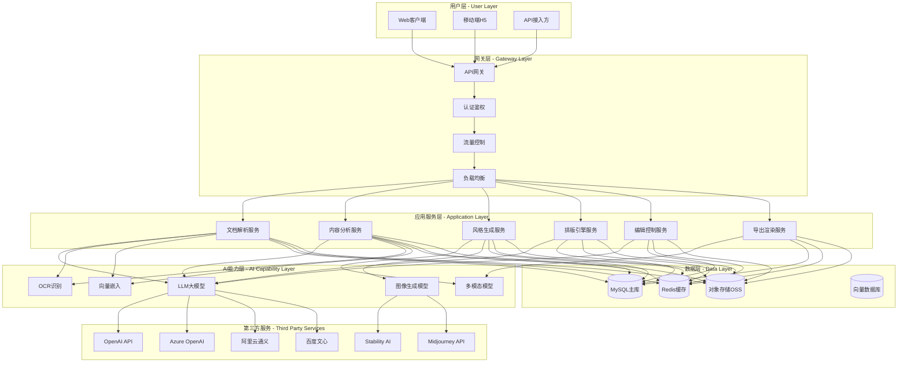
```mermaid
graph TB
    subgraph "用户层 - User Layer"
        U1[Web客户端]
        U2[移动端H5]
        U3[API接入方]
    end

    subgraph "网关层 - Gateway Layer"
        G1[API网关]
        G2[认证鉴权]
        G3[流量控制]
        G4[负载均衡]
    end

    subgraph "应用服务层 - Application Layer"
        A1[文档解析服务]
        A2[内容分析服务]
        A3[风格生成服务]
        A4[排版引擎服务]
        A5[编辑控制服务]
        A6[导出渲染服务]
    end

    subgraph "AI能力层 - AI Capability Layer"
        AI1[LLM大模型]
        AI2[多模态模型]
        AI3[图像生成模型]
        AI4[OCR识别]
        AI5[向量嵌入]
    end

    subgraph "数据层 - Data Layer"
        D1[(MySQL主库)]
        D2[(Redis缓存)]
        D3[(对象存储OSS)]
        D4[(向量数据库)]
    end

    subgraph "第三方服务 - Third Party Services"
        T1[OpenAI API]
        T2[Azure OpenAI]
        T3[阿里云通义]
        T4[百度文心]
        T5[Stability AI]
        T6[Midjourney API]
    end

    U1 --> G1
    U2 --> G1
    U3 --> G1
    G1 --> G2 --> G3 --> G4
    G4 --> A1 & A2 & A3 & A4 & A5 & A6
    A1 & A2 --> AI1 & AI4 & AI5
    A3 --> AI2 & AI3
    A4 & A5 --> AI1
    A6 --> AI2
    A1 & A2 & A3 & A4 & A5 & A6 --> D1 & D2 & D3
    AI1 --> T1 & T2 & T3 & T4
    AI3 --> T5 & T6
```

### 2.2 业务分层架构

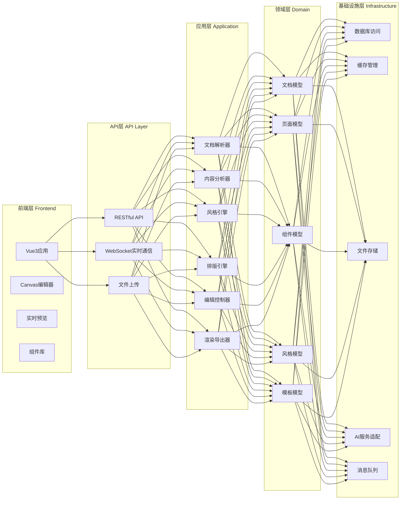
```mermaid
graph LR
    subgraph "前端层 Frontend"
        F1[Vue3应用]
        F2[Canvas编辑器]
        F3[实时预览]
        F4[组件库]
    end

    subgraph "API层 API Layer"
        API1[RESTful API]
        API2[WebSocket实时通信]
        API3[文件上传]
    end

    subgraph "应用层 Application"
        APP1[文档解析器]
        APP2[内容分析器]
        APP3[风格引擎]
        APP4[排版引擎]
        APP5[编辑控制器]
        APP6[渲染导出器]
    end

    subgraph "领域层 Domain"
        D1[文档模型]
        D2[页面模型]
        D3[组件模型]
        D4[风格模型]
        D5[模板模型]
    end

    subgraph "基础设施层 Infrastructure"
        I1[数据库访问]
        I2[缓存管理]
        I3[文件存储]
        I4[AI服务适配]
        I5[消息队列]
    end

    F1 --> API1 & API2 & API3
    API1 & API2 & API3 --> APP1 & APP2 & APP3 & APP4 & APP5 & APP6
    APP1 & APP2 & APP3 & APP4 & APP5 & APP6 --> D1 & D2 & D3 & D4 & D5
    D1 & D2 & D3 & D4 & D5 --> I1 & I2 & I3 & I4 & I5
```

---

## 三、核心功能模块设计

### 3.1 文档解析模块

#### 3.1.1 功能架构

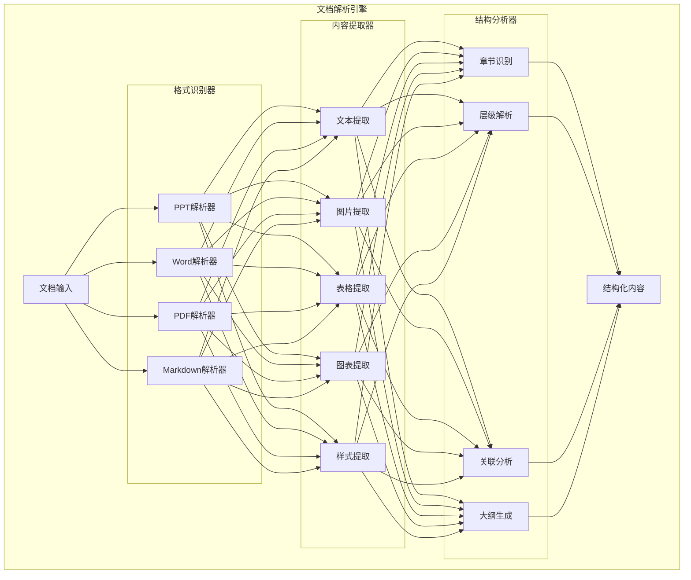
```mermaid
graph TB
    subgraph "文档解析引擎"
        INPUT[文档输入]
        
        subgraph "格式识别器"
            F1[PPT解析器]
            F2[Word解析器]
            F3[PDF解析器]
            F4[Markdown解析器]
        end
        
        subgraph "内容提取器"
            E1[文本提取]
            E2[图片提取]
            E3[表格提取]
            E4[图表提取]
            E5[样式提取]
        end
        
        subgraph "结构分析器"
            S1[章节识别]
            S2[层级解析]
            S3[关联分析]
            S4[大纲生成]
        end
        
        OUTPUT[结构化内容]
    end
    
    INPUT --> F1 & F2 & F3 & F4
    F1 & F2 & F3 & F4 --> E1 & E2 & E3 & E4 & E5
    E1 & E2 & E3 & E4 & E5 --> S1 & S2 & S3 & S4
    S1 & S2 & S3 & S4 --> OUTPUT
```

#### 3.1.2 技术实现方案

| 解析类型 | 技术方案 | Rust依赖 | 说明 |
|----------|----------|----------|------|
| **PPT解析** | POI-RS / 自研解析器 | `zip` + `quick-xml` | 解压PPTX，解析XML结构 |
| **Word解析** | docx-rs | `docx-rs` | 解析DOCX格式 |
| **PDF解析** | pdf-extract | `pdf-extract` `lopdf` | 提取文本和图片 |
| **Markdown** | pulldown-cmark | `pulldown-cmark` | 解析MD语法 |
| **OCR识别** | Tesseract / 云服务 | `tesseract` + API调用 | 图片文字识别 |

#### 3.1.3 数据结构设计

```rust
pub struct ParsedDocument {
    pub doc_id: i64,
    pub doc_type: DocType,
    pub title: String,
    pub language: String,
    pub industry: Option<String>,
    pub sections: Vec<Section>,
    pub metadata: DocumentMetadata,
    pub extracted_images: Vec<ExtractedImage>,
    pub style_hints: StyleHints,
}

pub struct Section {
    pub section_id: i64,
    pub level: u8,
    pub title: String,
    pub content: Vec<ContentBlock>,
    pub children: Vec<Section>,
    pub keywords: Vec<String>,
    pub importance_score: f32,
}

pub enum ContentBlock {
    Text(TextBlock),
    Image(ImageBlock),
    Table(TableBlock),
    Chart(ChartBlock),
    List(ListBlock),
    Code(CodeBlock),
}

pub struct StyleHints {
    pub detected_colors: Vec<String>,
    pub font_suggestions: Vec<String>,
    pub layout_hints: Vec<LayoutHint>,
    pub industry_style: Option<IndustryStyle>,
}
```

### 3.2 内容分析与行业识别模块

#### 3.2.1 分析流程图

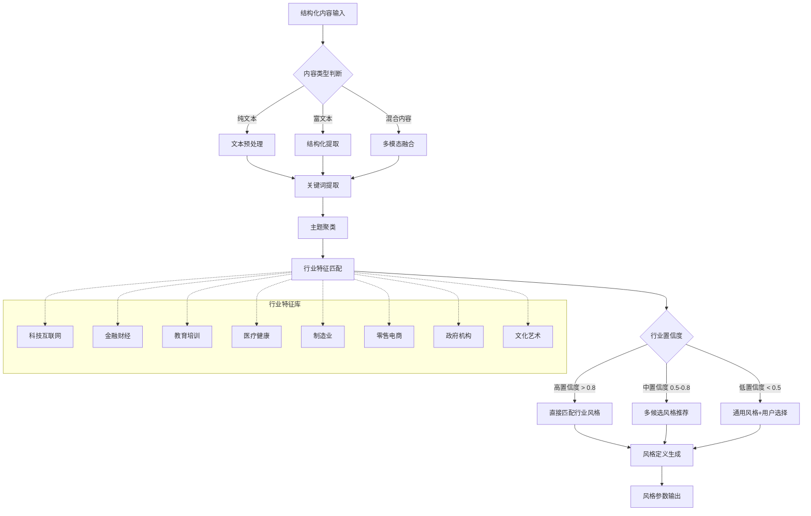
```mermaid
flowchart TD
    A[结构化内容输入] --> B{内容类型判断}
    
    B -->|纯文本| C[文本预处理]
    B -->|富文本| D[结构化提取]
    B -->|混合内容| E[多模态融合]
    
    C --> F[关键词提取]
    D --> F
    E --> F
    
    F --> G[主题聚类]
    G --> H[行业特征匹配]
    
    H --> I{行业置信度}
    I -->|高置信度 > 0.8| J[直接匹配行业风格]
    I -->|中置信度 0.5-0.8| K[多候选风格推荐]
    I -->|低置信度 < 0.5| L[通用风格+用户选择]
    
    J --> M[风格定义生成]
    K --> M
    L --> M
    
    M --> N[风格参数输出]
    
    subgraph "行业特征库"
        DB1[科技互联网]
        DB2[金融财经]
        DB3[教育培训]
        DB4[医疗健康]
        DB5[制造业]
        DB6[零售电商]
        DB7[政府机构]
        DB8[文化艺术]
    end
    
    H -.-> DB1 & DB2 & DB3 & DB4 & DB5 & DB6 & DB7 & DB8
```

#### 3.2.2 行业识别算法

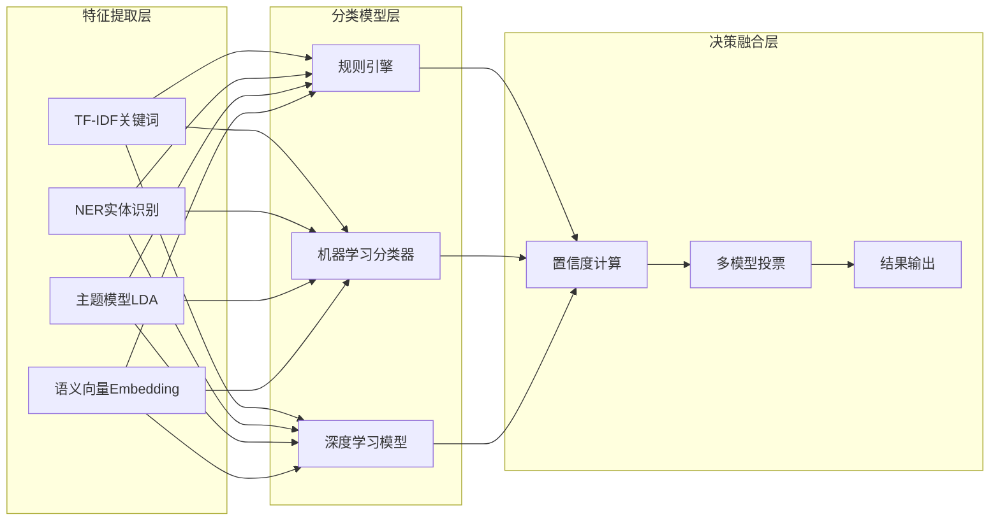
```mermaid
graph LR
    subgraph "特征提取层"
        T1[TF-IDF关键词]
        T2[NER实体识别]
        T3[主题模型LDA]
        T4[语义向量Embedding]
    end
    
    subgraph "分类模型层"
        M1[规则引擎]
        M2[机器学习分类器]
        M3[深度学习模型]
    end
    
    subgraph "决策融合层"
        D1[置信度计算]
        D2[多模型投票]
        D3[结果输出]
    end
    
    T1 & T2 & T3 & T4 --> M1 & M2 & M3
    M1 & M2 & M3 --> D1 --> D2 --> D3
```

#### 3.2.3 行业风格映射表

| 行业 | 主色调 | 辅助色 | 字体风格 | 图标风格 | 背景风格 |
|------|--------|--------|----------|----------|----------|
| **科技互联网** | 科技蓝 #0066FF | 活力橙 #FF6B00 | 现代无衬线 | 扁化线性 | 渐变科技感 |
| **金融财经** | 商务蓝 #1E3A8A | 金色 #D4AF37 | 正式衬线 | 稳重图标 | 简约专业 |
| **教育培训** | 活力绿 #10B981 | 温暖橙 #F59E0B | 友好圆润 | 卡通趣味 | 清新明亮 |
| **医疗健康** | 医疗蓝 #0EA5E9 | 健康绿 #22C55E | 清晰易读 | 简洁医疗 | 干净专业 |
| **制造业** | 工业灰 #475569 | 安全橙 #F97316 | 稳重粗体 | 技术图标 | 硬朗工业 |
| **零售电商** | 促销红 #EF4444 | 活力黄 #FBBF24 | 活泼现代 | 购物图标 | 热情活力 |
| **政府机构** | 庄重红 #DC2626 | 稳重金 #B8860B | 正式规范 | 国徽风格 | 庄严肃穆 |
| **文化艺术** | 艺术紫 #8B5CF6 | 优雅金 #D4AF37 | 优雅衬线 | 艺术图标 | 文艺典雅 |

### 3.3 风格生成与一致性保证模块

#### 3.3.1 风格生成流程

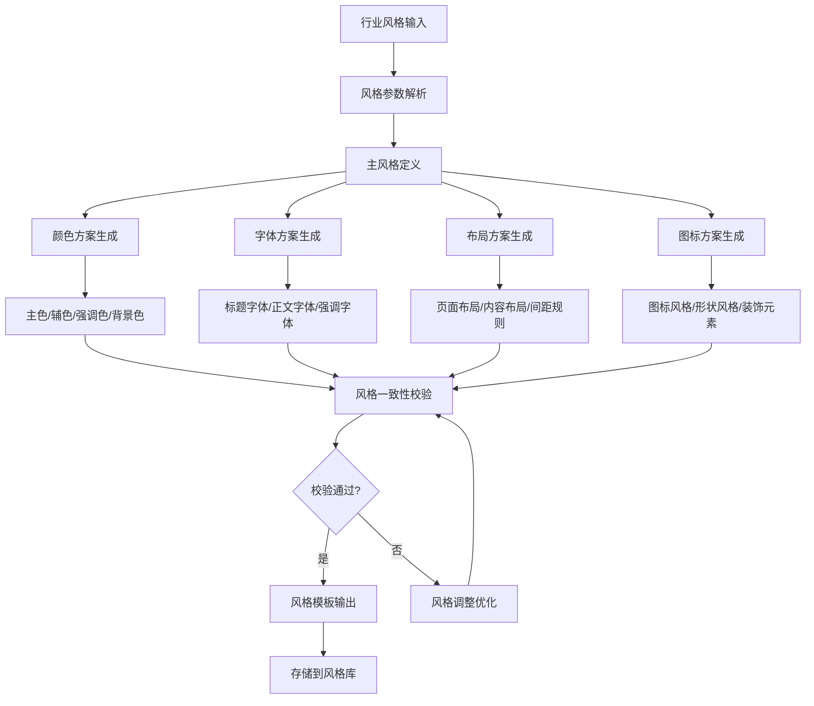
```mermaid
flowchart TB
    A[行业风格输入] --> B[风格参数解析]
    B --> C[主风格定义]
    
    C --> D[颜色方案生成]
    C --> E[字体方案生成]
    C --> F[布局方案生成]
    C --> G[图标方案生成]
    
    D --> H[主色/辅色/强调色/背景色]
    E --> I[标题字体/正文字体/强调字体]
    F --> J[页面布局/内容布局/间距规则]
    G --> K[图标风格/形状风格/装饰元素]
    
    H & I & J & K --> L[风格一致性校验]
    L --> M{校验通过?}
    
    M -->|是| N[风格模板输出]
    M -->|否| O[风格调整优化]
    O --> L
    
    N --> P[存储到风格库]
```

#### 3.3.2 风格一致性保证机制

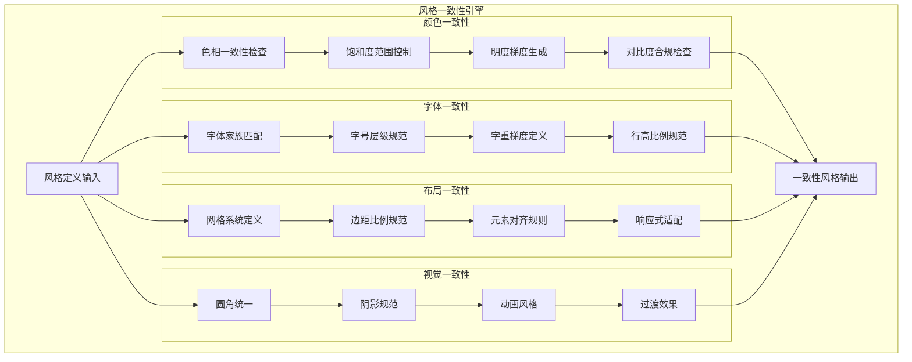
```mermaid
graph TB
    subgraph "风格一致性引擎"
        INPUT[风格定义输入]
        
        subgraph "颜色一致性"
            C1[色相一致性检查]
            C2[饱和度范围控制]
            C3[明度梯度生成]
            C4[对比度合规检查]
        end
        
        subgraph "字体一致性"
            F1[字体家族匹配]
            F2[字号层级规范]
            F3[字重梯度定义]
            F4[行高比例规范]
        end
        
        subgraph "布局一致性"
            L1[网格系统定义]
            L2[边距比例规范]
            L3[元素对齐规则]
            L4[响应式适配]
        end
        
        subgraph "视觉一致性"
            V1[圆角统一]
            V2[阴影规范]
            V3[动画风格]
            V4[过渡效果]
        end
        
        OUTPUT[一致性风格输出]
    end
    
    INPUT --> C1 & F1 & L1 & V1
    C1 --> C2 --> C3 --> C4
    F1 --> F2 --> F3 --> F4
    L1 --> L2 --> L3 --> L4
    V1 --> V2 --> V3 --> V4
    C4 & F4 & L4 & V4 --> OUTPUT
```

#### 3.3.3 AI背景图生成策略

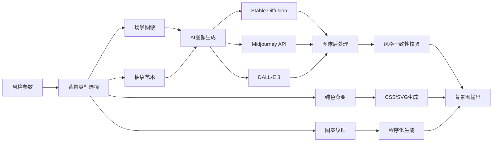
```mermaid
flowchart LR
    A[风格参数] --> B[背景类型选择]
    
    B --> C[纯色渐变]
    B --> D[图案纹理]
    B --> E[场景图像]
    B --> F[抽象艺术]
    
    C --> G[CSS/SVG生成]
    D --> H[程序化生成]
    E --> I[AI图像生成]
    F --> I
    
    I --> J[Stable Diffusion]
    I --> K[Midjourney API]
    I --> L[DALL-E 3]
    
    J & K & L --> M[图像后处理]
    M --> N[风格一致性校验]
    N --> O[背景图输出]
    
    G & H --> O
```

### 3.4 智能排版引擎

#### 3.4.1 排版流程图

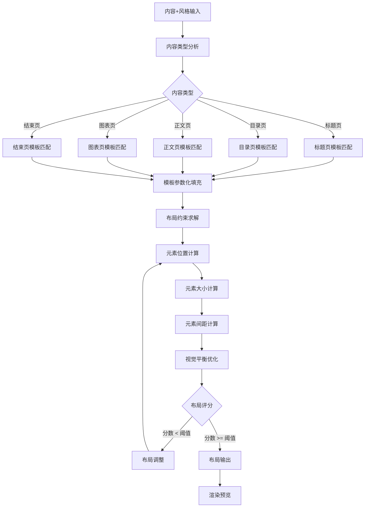
```mermaid
flowchart TB
    A[内容+风格输入] --> B[内容类型分析]
    
    B --> C{内容类型}
    C -->|标题页| D[标题页模板匹配]
    C -->|目录页| E[目录页模板匹配]
    C -->|正文页| F[正文页模板匹配]
    C -->|图表页| G[图表页模板匹配]
    C -->|结束页| H[结束页模板匹配]
    
    D & E & F & G & H --> I[模板参数化填充]
    I --> J[布局约束求解]
    
    J --> K[元素位置计算]
    K --> L[元素大小计算]
    L --> M[元素间距计算]
    M --> N[视觉平衡优化]
    
    N --> O{布局评分}
    O -->|分数 < 阈值| P[布局调整]
    P --> K
    O -->|分数 >= 阈值| Q[布局输出]
    
    Q --> R[渲染预览]
```

#### 3.4.2 智能布局算法

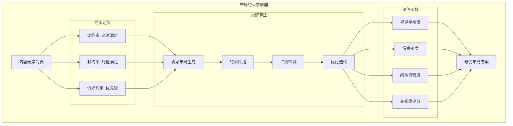
```mermaid
graph TB
    subgraph "布局约束求解器"
        INPUT[内容元素列表]
        
        subgraph "约束定义"
            C1[硬约束: 必须满足]
            C2[软约束: 尽量满足]
            C3[偏好约束: 优先级]
        end
        
        subgraph "求解算法"
            S1[初始布局生成]
            S2[约束传播]
            S3[冲突检测]
            S4[优化迭代]
        end
        
        subgraph "评估函数"
            E1[视觉平衡度]
            E2[信息密度]
            E3[阅读流畅度]
            E4[美观度评分]
        end
        
        OUTPUT[最优布局方案]
    end
    
    INPUT --> C1 & C2 & C3
    C1 & C2 & C3 --> S1 --> S2 --> S3 --> S4
    S4 --> E1 & E2 & E3 & E4
    E1 & E2 & E3 & E4 --> OUTPUT
```

### 3.5 编辑控制模块

#### 3.5.1 精准编辑流程

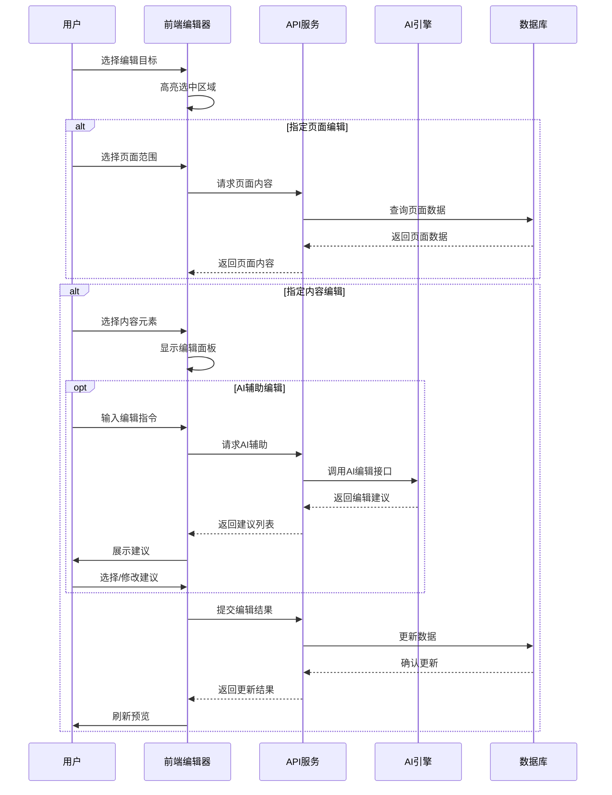
```mermaid
sequenceDiagram
    participant U as 用户
    participant F as 前端编辑器
    participant A as API服务
    participant AI as AI引擎
    participant D as 数据库
    
    U->>F: 选择编辑目标
    F->>F: 高亮选中区域
    
    alt 指定页面编辑
        U->>F: 选择页面范围
        F->>A: 请求页面内容
        A->>D: 查询页面数据
        D-->>A: 返回页面数据
        A-->>F: 返回页面内容
    end
    
    alt 指定内容编辑
        U->>F: 选择内容元素
        F->>F: 显示编辑面板
        
        opt AI辅助编辑
            U->>F: 输入编辑指令
            F->>A: 请求AI辅助
            A->>AI: 调用AI编辑接口
            AI-->>A: 返回编辑建议
            A-->>F: 返回建议列表
            F->>U: 展示建议
            U->>F: 选择/修改建议
        end
        
        F->>A: 提交编辑结果
        A->>D: 更新数据
        D-->>A: 确认更新
        A-->>F: 返回更新结果
        F->>U: 刷新预览
    end
```

#### 3.5.2 编辑操作类型

| 操作类型 | 说明 | AI辅助能力 |
|----------|------|------------|
| **文本编辑** | 修改文字内容、调整格式 | 润色、续写、总结、翻译 |
| **图片编辑** | 替换、裁剪、滤镜 | AI生成、风格迁移、智能抠图 |
| **布局调整** | 移动、缩放、对齐 | 智能布局建议、自动对齐 |
| **样式修改** | 颜色、字体、效果 | 风格一致性建议、配色推荐 |
| **页面操作** | 添加、删除、复制、排序 | 内容续写、智能分页 |
| **批量操作** | 批量修改、全局替换 | 批量AI处理、一致性检查 |

### 3.6 反推提示词功能（商业化亮点）

#### 3.6.1 功能流程

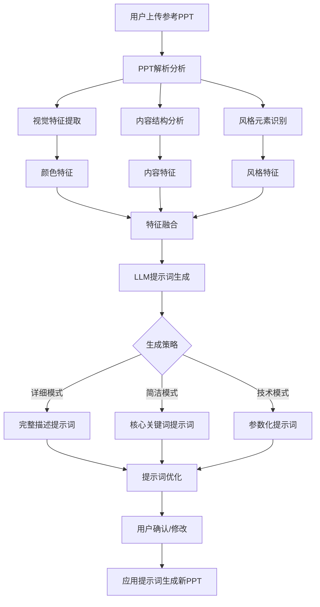
```mermaid
flowchart TB
    A[用户上传参考PPT] --> B[PPT解析分析]
    B --> C[视觉特征提取]
    B --> D[内容结构分析]
    B --> E[风格元素识别]
    
    C --> F[颜色特征]
    D --> G[内容特征]
    E --> H[风格特征]
    
    F & G & H --> I[特征融合]
    I --> J[LLM提示词生成]
    
    J --> K{生成策略}
    K -->|详细模式| L[完整描述提示词]
    K -->|简洁模式| M[核心关键词提示词]
    K -->|技术模式| N[参数化提示词]
    
    L & M & N --> O[提示词优化]
    O --> P[用户确认/修改]
    P --> Q[应用提示词生成新PPT]
```

#### 3.6.2 提示词生成算法

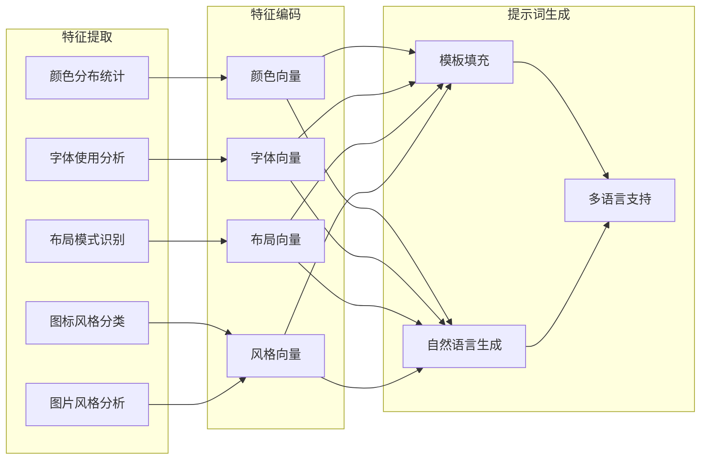
```mermaid
graph LR
    subgraph "特征提取"
        T1[颜色分布统计]
        T2[字体使用分析]
        T3[布局模式识别]
        T4[图标风格分类]
        T5[图片风格分析]
    end
    
    subgraph "特征编码"
        E1[颜色向量]
        E2[字体向量]
        E3[布局向量]
        E4[风格向量]
    end
    
    subgraph "提示词生成"
        P1[模板填充]
        P2[自然语言生成]
        P3[多语言支持]
    end
    
    T1 --> E1
    T2 --> E2
    T3 --> E3
    T4 & T5 --> E4
    
    E1 & E2 & E3 & E4 --> P1 & P2 --> P3
```

#### 3.6.3 提示词模板示例

```
## 详细模式提示词模板

生成一份{行业}风格的PPT演示文稿，主题为"{主题}"。

### 整体风格要求：
- 主色调：{主色}（{色值}），占比约60%
- 辅助色：{辅助色}（{色值}），占比约30%
- 强调色：{强调色}（{色值}），占比约10%
- 背景风格：{背景描述}

### 字体规范：
- 标题字体：{标题字体}，字号{字号}，字重{字重}
- 正文字体：{正文字体}，字号{字号}，行高{行高}

### 布局特点：
- 页面布局：{布局类型}
- 内容区域：{内容区域描述}
- 留白比例：{留白比例}

### 视觉元素：
- 图标风格：{图标风格}
- 装饰元素：{装饰元素描述}
- 图片处理：{图片处理方式}

### 内容结构：
{内容大纲}
```

---

## 四、前后端交互设计

### 4.1 API接口设计

#### 4.1.1 核心API列表

| 接口 | 方法 | 路径 | 说明 |
|------|------|------|------|
| 文档上传解析 | POST | /api/ppt/document/parse | 上传文档并解析 |
| 行业识别 | POST | /api/ppt/analyze/industry | 分析内容识别行业 |
| 风格生成 | POST | /api/ppt/style/generate | 生成风格方案 |
| PPT生成 | POST | /api/ppt/generate | 生成完整PPT |
| 页面编辑 | PUT | /api/ppt/page/{id} | 编辑指定页面 |
| 内容编辑 | PUT | /api/ppt/content/{id} | 编辑指定内容 |
| AI润色 | POST | /api/ppt/ai/polish | AI内容润色 |
| AI续写 | POST | /api/ppt/ai/continue | AI内容续写 |
| AI总结 | POST | /api/ppt/ai/summarize | AI内容总结 |
| 反推提示词 | POST | /api/ppt/prompt/reverse | 从PPT反推提示词 |
| 导出PPT | GET | /api/ppt/export/{id} | 导出PPT文件 |
| 模板列表 | GET | /api/ppt/template/list | 获取模板列表 |

#### 4.1.2 WebSocket实时通信

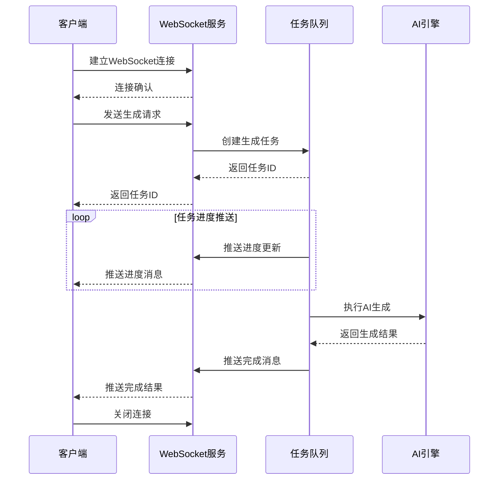
```mermaid
sequenceDiagram
    participant C as 客户端
    participant W as WebSocket服务
    participant Q as 任务队列
    participant A as AI引擎
    
    C->>W: 建立WebSocket连接
    W-->>C: 连接确认
    
    C->>W: 发送生成请求
    W->>Q: 创建生成任务
    Q-->>W: 返回任务ID
    W-->>C: 返回任务ID
    
    loop 任务进度推送
        Q->>W: 推送进度更新
        W-->>C: 推送进度消息
    end
    
    Q->>A: 执行AI生成
    A-->>Q: 返回生成结果
    Q->>W: 推送完成消息
    W-->>C: 推送完成结果
    
    C->>W: 关闭连接
```

### 4.2 前端架构设计

#### 4.2.1 组件结构图

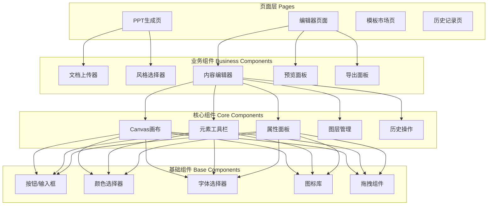
```mermaid
graph TB
    subgraph "页面层 Pages"
        P1[PPT生成页]
        P2[编辑器页面]
        P3[模板市场页]
        P4[历史记录页]
    end
    
    subgraph "业务组件 Business Components"
        B1[文档上传器]
        B2[风格选择器]
        B3[内容编辑器]
        B4[预览面板]
        B5[导出面板]
    end
    
    subgraph "核心组件 Core Components"
        C1[Canvas画布]
        C2[元素工具栏]
        C3[属性面板]
        C4[图层管理]
        C5[历史操作]
    end
    
    subgraph "基础组件 Base Components"
        D1[按钮/输入框]
        D2[颜色选择器]
        D3[字体选择器]
        D4[图标库]
        D5[拖拽组件]
    end
    
    P1 --> B1 & B2
    P2 --> B3 & B4 & B5
    B3 --> C1 & C2 & C3 & C4 & C5
    C1 & C2 & C3 --> D1 & D2 & D3 & D4 & D5
```

#### 4.2.2 状态管理设计

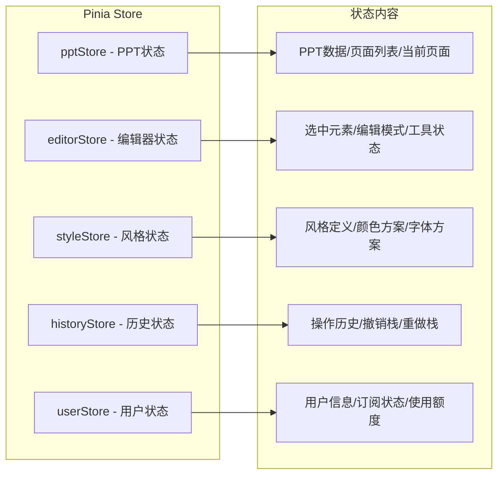
```mermaid
graph LR
    subgraph "Pinia Store"
        S1[pptStore - PPT状态]
        S2[editorStore - 编辑器状态]
        S3[styleStore - 风格状态]
        S4[historyStore - 历史状态]
        S5[userStore - 用户状态]
    end
    
    subgraph "状态内容"
        S1 --> PPT数据/页面列表/当前页面
        S2 --> 选中元素/编辑模式/工具状态
        S3 --> 风格定义/颜色方案/字体方案
        S4 --> 操作历史/撤销栈/重做栈
        S5 --> 用户信息/订阅状态/使用额度
    end
```

---

## 五、AI服务集成设计

### 5.1 AI服务架构

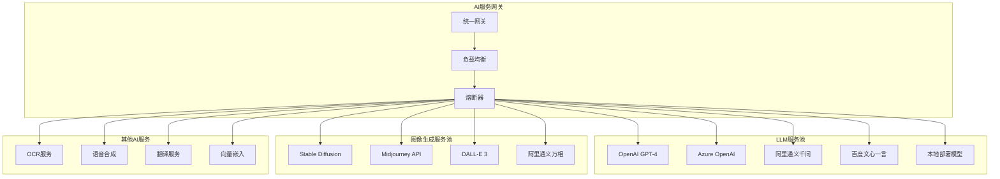
```mermaid
graph TB
    subgraph "AI服务网关"
        GW[统一网关]
        LB[负载均衡]
        CB[熔断器]
    end
    
    subgraph "LLM服务池"
        L1[OpenAI GPT-4]
        L2[Azure OpenAI]
        L3[阿里通义千问]
        L4[百度文心一言]
        L5[本地部署模型]
    end
    
    subgraph "图像生成服务池"
        I1[Stable Diffusion]
        I2[Midjourney API]
        I3[DALL-E 3]
        I4[阿里通义万相]
    end
    
    subgraph "其他AI服务"
        O1[OCR服务]
        O2[语音合成]
        O3[翻译服务]
        O4[向量嵌入]
    end
    
    GW --> LB --> CB
    CB --> L1 & L2 & L3 & L4 & L5
    CB --> I1 & I2 & I3 & I4
    CB --> O1 & O2 & O3 & O4
```

### 5.2 AI服务调用策略

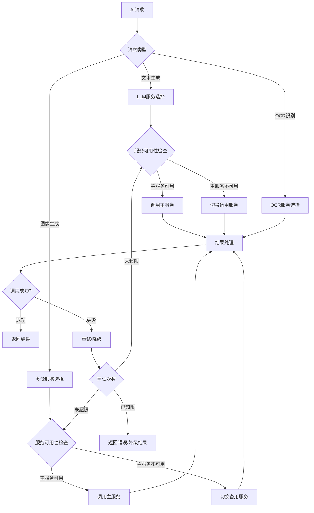
```mermaid
flowchart TB
    A[AI请求] --> B{请求类型}
    
    B -->|文本生成| C[LLM服务选择]
    B -->|图像生成| D[图像服务选择]
    B -->|OCR识别| E[OCR服务选择]
    
    C --> F{服务可用性检查}
    F -->|主服务可用| G[调用主服务]
    F -->|主服务不可用| H[切换备用服务]
    
    D --> I{服务可用性检查}
    I -->|主服务可用| J[调用主服务]
    I -->|主服务不可用| K[切换备用服务]
    
    G & H --> L[结果处理]
    J & K --> L
    E --> L
    
    L --> M{调用成功?}
    M -->|成功| N[返回结果]
    M -->|失败| O[重试/降级]
    O --> P{重试次数}
    P -->|未超限| F & I
    P -->|已超限| Q[返回错误/降级结果]
```

### 5.3 AI服务配置

```yaml
ai_services:
  llm:
    primary:
      provider: "openai"
      model: "gpt-4-turbo"
      api_key: "${OPENAI_API_KEY}"
      base_url: "https://api.openai.com/v1"
      max_tokens: 4096
      temperature: 0.7
    
    fallback:
      - provider: "azure"
        model: "gpt-4"
        api_key: "${AZURE_OPENAI_KEY}"
        endpoint: "${AZURE_ENDPOINT}"
      - provider: "aliyun"
        model: "qwen-max"
        api_key: "${ALIYUN_API_KEY}"
  
  image_generation:
    primary:
      provider: "stability"
      model: "stable-diffusion-xl"
      api_key: "${STABILITY_API_KEY}"
    
    fallback:
      - provider: "openai"
        model: "dall-e-3"
      - provider: "midjourney"
        api_key: "${MJ_API_KEY}"
  
  ocr:
    primary:
      provider: "aliyun"
      api_key: "${ALIYUN_OCR_KEY}"
    
    fallback:
      - provider: "baidu"
        api_key: "${BAIDU_OCR_KEY}"
```

---

## 六、数据库设计

### 6.1 核心表结构

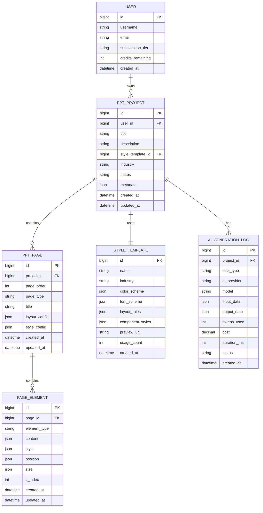
```mermaid
erDiagram
    PPT_PROJECT ||--o{ PPT_PAGE : contains
    PPT_PAGE ||--o{ PAGE_ELEMENT : contains
    PPT_PROJECT ||--|| STYLE_TEMPLATE : uses
    PPT_PROJECT ||--o{ AI_GENERATION_LOG : has
    USER ||--o{ PPT_PROJECT : owns
    
    PPT_PROJECT {
        bigint id PK
        bigint user_id FK
        string title
        string description
        bigint style_template_id FK
        string industry
        string status
        json metadata
        datetime created_at
        datetime updated_at
    }
    
    PPT_PAGE {
        bigint id PK
        bigint project_id FK
        int page_order
        string page_type
        string title
        json layout_config
        json style_config
        datetime created_at
        datetime updated_at
    }
    
    PAGE_ELEMENT {
        bigint id PK
        bigint page_id FK
        string element_type
        json content
        json style
        json position
        json size
        int z_index
        datetime created_at
        datetime updated_at
    }
    
    STYLE_TEMPLATE {
        bigint id PK
        string name
        string industry
        json color_scheme
        json font_scheme
        json layout_rules
        json component_styles
        string preview_url
        int usage_count
        datetime created_at
    }
    
    AI_GENERATION_LOG {
        bigint id PK
        bigint project_id FK
        string task_type
        string ai_provider
        string model
        json input_data
        json output_data
        int tokens_used
        decimal cost
        int duration_ms
        string status
        datetime created_at
    }
    
    USER {
        bigint id PK
        string username
        string email
        string subscription_tier
        int credits_remaining
        datetime created_at
    }
```

### 6.2 表详细设计

#### 6.2.1 PPT项目表 (ppt_project)

| 字段名 | 类型 | 说明 |
|--------|------|------|
| id | bigint | 主键ID |
| user_id | bigint | 用户ID |
| title | varchar(200) | 项目标题 |
| description | text | 项目描述 |
| source_type | varchar(20) | 来源类型(ppt/word/pdf/md) |
| source_file | varchar(500) | 源文件路径 |
| style_template_id | bigint | 风格模板ID |
| industry | varchar(50) | 识别的行业 |
| industry_confidence | decimal(5,4) | 行业置信度 |
| status | varchar(20) | 状态(draft/generating/completed) |
| metadata | json | 元数据(页数、字数等) |
| created_at | datetime | 创建时间 |
| updated_at | datetime | 更新时间 |

#### 6.2.2 页面元素表 (page_element)

| 字段名 | 类型 | 说明 |
|--------|------|------|
| id | bigint | 主键ID |
| page_id | bigint | 页面ID |
| element_type | varchar(30) | 元素类型(text/image/shape/chart/table) |
| content | json | 内容数据 |
| style | json | 样式数据 |
| position | json | 位置数据{x, y} |
| size | json | 尺寸数据{width, height} |
| rotation | decimal(5,2) | 旋转角度 |
| z_index | int | 层级 |
| locked | tinyint | 是否锁定 |
| created_at | datetime | 创建时间 |
| updated_at | datetime | 更新时间 |

---

## 七、商业化功能设计

### 7.1 订阅套餐设计

| 套餐 | 价格 | 功能限制 | AI调用额度 |
|------|------|----------|------------|
| **免费版** | ¥0/月 | 3个项目，基础模板 | 10次/月 |
| **基础版** | ¥29/月 | 10个项目，标准模板 | 100次/月 |
| **专业版** | ¥99/月 | 50个项目，高级模板，API接口 | 500次/月 |
| **企业版** | ¥299/月 | 无限项目，全部功能，优先支持 | 2000次/月 |
| **定制版** | 联系销售 | 私有部署，定制开发 | 无限 |

### 7.2 商业亮点功能

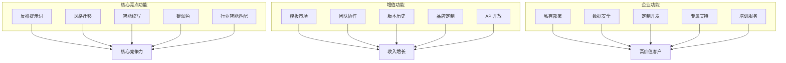
```mermaid
graph TB
    subgraph "核心亮点功能"
        F1[反推提示词]
        F2[风格迁移]
        F3[智能续写]
        F4[一键润色]
        F5[行业智能匹配]
    end
    
    subgraph "增值功能"
        A1[模板市场]
        A2[团队协作]
        A3[版本历史]
        A4[品牌定制]
        A5[API开放]
    end
    
    subgraph "企业功能"
        E1[私有部署]
        E2[数据安全]
        E3[定制开发]
        E4[专属支持]
        E5[培训服务]
    end
    
    F1 & F2 & F3 & F4 & F5 --> 核心竞争力
    A1 & A2 & A3 & A4 & A5 --> 收入增长
    E1 & E2 & E3 & E4 & E5 --> 高价值客户
```

### 7.3 收入模型

```mermaid
pie title 收入来源预测
    "SaaS订阅" : 40
    "API调用" : 25
    "模板市场" : 15
    "企业定制" : 15
    "增值服务" : 5
```

---

## 八、技术选型与依赖

### 8.1 后端技术栈 (Rust)

| 模块 | 技术选型 | 版本 | 用途 |
|------|----------|------|------|
| Web框架 | Axum | 0.8.x | HTTP服务 |
| ORM | Sea-ORM | 1.1.x | 数据库操作 |
| 异步运行时 | Tokio | 1.x | 异步处理 |
| 文档解析 | docx-rs, lopdf | latest | 文档解析 |
| HTTP客户端 | reqwest | 0.12.x | AI API调用 |
| 序列化 | serde, serde_json | 1.x | JSON处理 |
| 缓存 | redis | 0.32.x | Redis客户端 |
| 任务队列 | 自研/redis | - | 异步任务 |
| WebSocket | axum/ws | - | 实时通信 |
| PDF生成 | printpdf | 0.7.x | PDF导出 |
| 图像处理 | image | 0.25.x | 图像处理 |

### 8.2 前端技术栈 (Vue3)

| 模块 | 技术选型 | 版本 | 用途 |
|------|----------|------|------|
| 框架 | Vue | 3.4.x | 核心框架 |
| 构建 | Vite | 5.2.x | 构建工具 |
| 状态管理 | Pinia | 2.1.x | 状态管理 |
| UI组件 | Element Plus | 2.7.x | UI组件库 |
| Canvas | Fabric.js / Konva | latest | 画布编辑 |
| 图表 | ECharts | 6.x | 图表展示 |
| 拖拽 | vuedraggable | 4.x | 拖拽功能 |
| 富文本 | @wangeditor | 5.x | 富文本编辑 |
| HTTP | Axios | 1.x | HTTP请求 |

### 8.3 第三方AI服务

| 服务类型 | 推荐服务商 | 备选方案 |
|----------|------------|----------|
| LLM | OpenAI GPT-4 | Azure OpenAI, 通义千问 |
| 图像生成 | Stable Diffusion | Midjourney, DALL-E 3 |
| OCR | 阿里云OCR | 百度OCR, 腾讯OCR |
| 向量嵌入 | OpenAI Embedding | 本地部署BGE |
| 语音合成 | 阿里云TTS | 百度TTS |

---

## 九、开发计划与里程碑

### 9.1 开发阶段规划

```mermaid
gantt
    title AI PPT生成系统开发计划
    dateFormat YYYY-MM-DD
    
    section 第一阶段-基础框架
    后端架构搭建 :a1, 2026-04-01, 14d
    前端框架搭建 :a2, 2026-04-01, 14d
    数据库设计实现 :a3, 2026-04-08, 7d
    
    section 第二阶段-核心功能
    文档解析模块 :b1, 2026-04-15, 14d
    内容分析模块 :b2, 2026-04-22, 14d
    风格生成模块 :b3, 2026-05-01, 14d
    排版引擎模块 :b4, 2026-05-08, 14d
    
    section 第三阶段-AI集成
    LLM服务集成 :c1, 2026-05-15, 10d
    图像生成集成 :c2, 2026-05-20, 10d
    AI编辑功能 :c3, 2026-05-25, 10d
    
    section 第四阶段-编辑器
    Canvas编辑器 :d1, 2026-06-01, 14d
    实时预览 :d2, 2026-06-08, 7d
    导出功能 :d3, 2026-06-15, 7d
    
    section 第五阶段-商业化
    用户系统 :e1, 2026-06-15, 7d
    订阅系统 :e2, 2026-06-20, 7d
    模板市场 :e3, 2026-06-25, 10d
    
    section 第六阶段-测试上线
    集成测试 :f1, 2026-07-01, 10d
    性能优化 :f2, 2026-07-10, 7d
    正式上线 :f3, 2026-07-17, 3d
```

### 9.2 里程碑定义

| 里程碑 | 时间 | 交付物 |
|--------|------|--------|
| **M1-基础框架** | 2026-04-14 | 可运行的前后端框架 |
| **M2-核心功能** | 2026-05-21 | 文档解析+内容分析+风格生成 |
| **M3-AI集成** | 2026-06-04 | AI服务集成完成 |
| **M4-编辑器** | 2026-06-21 | 可视化编辑器完成 |
| **M5-商业化** | 2026-07-04 | 商业化功能完成 |
| **M6-上线** | 2026-07-20 | 正式版本发布 |

---

## 十、风险评估与应对

### 10.1 技术风险

| 风险项 | 风险等级 | 应对措施 |
|--------|----------|----------|
| AI服务不稳定 | 高 | 多服务商备份，本地模型兜底 |
| 大文件解析性能 | 中 | 异步处理，进度反馈 |
| 并发生成压力 | 中 | 任务队列，限流控制 |
| 风格一致性难保证 | 中 | 规则引擎+AI校验双重保障 |

### 10.2 商业风险

| 风险项 | 风险等级 | 应对措施 |
|--------|----------|----------|
| AI成本过高 | 高 | 缓存策略，模型优化，套餐限制 |
| 用户付费意愿低 | 中 | 免费试用，价值展示，功能差异化 |
| 竞品竞争 | 中 | 持续创新，特色功能，用户体验 |

---

## 十一、多专家讨论记录

### 11.1 架构专家意见

> **架构专家**：建议采用微服务架构，将文档解析、AI服务、渲染导出拆分为独立服务，便于独立扩展和维护。AI服务层需要设计熔断和降级机制，避免第三方服务故障影响整体系统。

### 11.2 AI专家意见

> **AI专家**：行业识别建议使用多模型融合策略，结合规则引擎和深度学习模型，提高识别准确率。风格一致性可以通过训练专门的风格迁移模型来实现，减少对通用模型的依赖。建议引入向量数据库存储风格特征，支持相似风格检索。

### 11.3 前端专家意见

> **前端专家**：Canvas编辑器建议使用Fabric.js，它提供了丰富的对象操作API和事件系统。对于复杂排版，可以实现虚拟滚动和懒加载优化性能。实时预览可以通过WebWorker在后台渲染，避免阻塞主线程。

### 11.4 产品专家意见

> **产品专家**：反推提示词功能是核心差异化亮点，建议重点打磨用户体验。可以提供"一键复刻"功能，用户上传喜欢的PPT，系统自动分析并生成相同风格的模板。模板市场可以作为独立变现渠道，引入设计师入驻。

### 11.5 商业专家意见

> **商业专家**：建议采用Freemium模式，免费版提供基础功能吸引用户，高级功能通过订阅解锁。API接口可以作为独立产品线，面向企业客户提供批量生成能力。可以考虑与办公软件厂商合作，作为插件集成。

---

## 十二、总结

本方案详细设计了AI智能PPT生成系统的完整架构，包括：

1. **技术架构**：基于Rust+Vue3的技术栈，分层架构设计
2. **核心功能**：文档解析、内容分析、风格生成、智能排版、精准编辑
3. **AI集成**：多服务商策略，熔断降级机制
4. **商业化**：订阅模式、模板市场、API开放
5. **亮点功能**：反推提示词、风格迁移、智能续写

该方案具备可行性，技术选型合理，商业模式清晰，可作为后续开发的指导文档。
