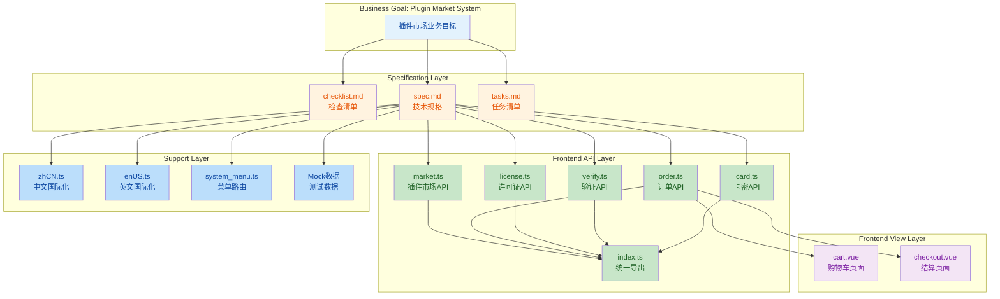
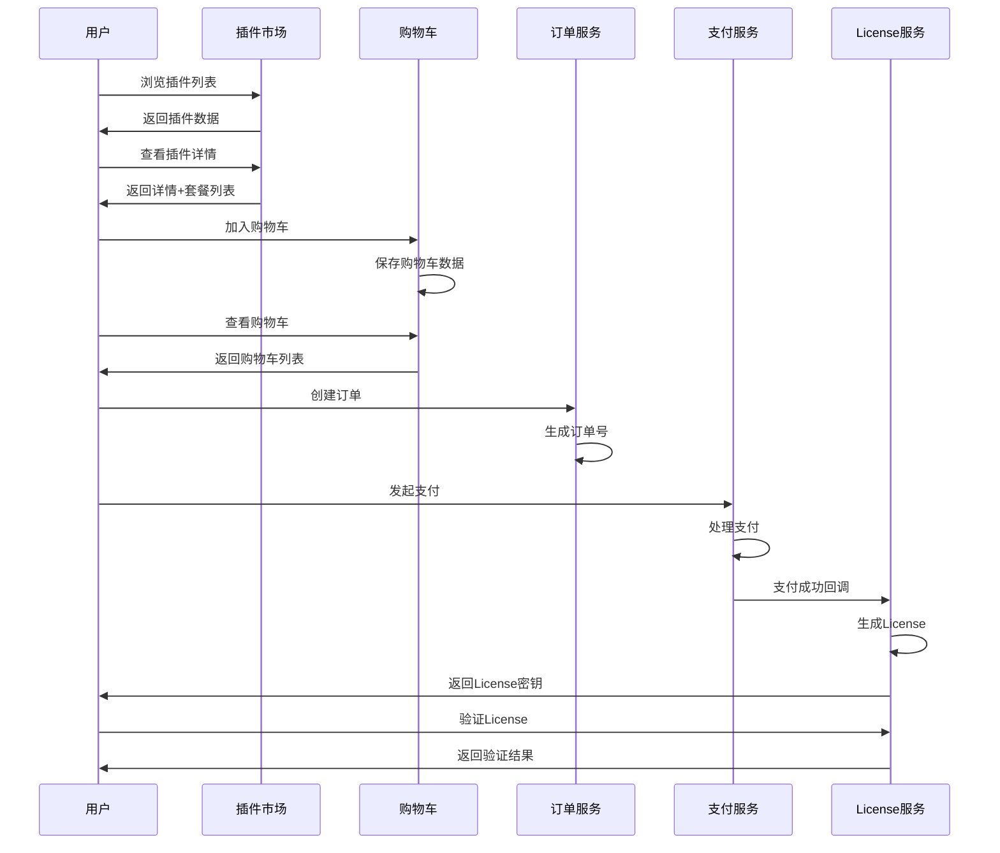

## 1. High-Level Summary (TL;DR)

- **Impact:** High - 新增完整的插件市场/应用市场系统架构，包含数据库设计、API定义、前端实现和国际化支持
- **Key Changes:**
  - 新增三个完整的规范文档（检查清单、技术规格、任务清单）
  - 创建插件市场前端 API 模块（6个模块文件）
  - 新增购物车和结算页面的 Vue 组件
  - 完善中英文国际化支持（新增200+翻译条目）
  - 添加 Mock 数据和菜单路由配置

***

## 2. Visual Overview (Code & Logic Map)



***

## 3. Detailed Change Analysis

### 3.1 规范文档层

#### 新增文件

| 文件路径                                     | 行数   | 描述                        |
| :--------------------------------------- | :--- | :------------------------ |
| `.trae/specs/plugin-market/checklist.md` | 648  | 完整的开发检查清单，涵盖8个阶段          |
| `.trae/specs/plugin-market/spec.md`      | 1143 | 技术规格文档，包含架构设计、API定义、数据库设计 |
| `.trae/specs/plugin-market/tasks.md`     | 545  | 任务清单，按模块化方式组织开发任务         |

**checklist.md 关键内容：**

- 阶段一：数据库与实体层（12张表设计）
- 阶段二：业务服务层（插件、交易、License、卡密服务）
- 阶段三：API路由层（30+个接口）
- 阶段四：前端API模块
- 阶段五：Mock数据
- 阶段六：前端页面（20+页面）
- 阶段七：国际化与菜单
- 阶段八：权限与安全

**spec.md 核心设计：**

```rust
// 插件实体设计示例
struct Plugin {
    id: i64,
    code: String,              // 插件编码（唯一）
    name: String,
    category_id: i64,
    developer_id: i64,
    price_type: PriceType,    // 免费/一次性/订阅
    verify_level: VerifyLevel, // 无/基础/高级验证
    status: PluginStatus,
    // ...
}
```

### 3.2 前端 API 模块层

#### 新增文件结构

```
frontend/src/api/modules/plugin-market/
├── index.ts       # 统一导出
├── market.ts      # 市场相关API（插件、分类、开发者、版本、套餐、评论）
├── order.ts       # 订单相关API（购物车、订单）
├── license.ts     # 许可证相关API（License、订阅、设备）
├── verify.ts      # 验证相关API（验证码、混淆配置）
└── card.ts       # 卡密相关API（生成、兑换、导出）
```

#### API 接口定义

| 模块            | 主要方法                                                                             | 功能     |
| :------------ | :------------------------------------------------------------------------------- | :----- |
| **market**    | `list()`, `detail()`, `search()`, `recommend()`, `hot()`                         | 插件市场浏览 |
| **category**  | `list()`, `tree()`, `detail()`, `add()`, `edit()`, `delete()`                    | 分类管理   |
| **developer** | `list()`, `add()`, `edit()`, `delete()`, `audit()`, `versionAdd()`               | 开发者管理  |
| **cart**      | `list()`, `add()`, `remove()`, `clear()`                                         | 购物车操作  |
| **order**     | `create()`, `list()`, `detail()`, `cancel()`, `pay()`, `payCallback()`           | 订单管理   |
| **license**   | `list()`, `detail()`, `bind()`, `unbind()`, `renew()`, `verify()`, `heartbeat()` | 许可证管理  |
| **verify**    | `sendCode()`, `checkCode()`, `obfuscationConfig()`                               | 验证码与混淆 |
| **card**      | `generate()`, `batchList()`, `export()`, `redeem()`, `freeze()`, `unfreeze()`    | 卡密管理   |

### 3.3 前端视图层

#### 新增页面组件

**cart.vue - 购物车页面**

- 功能特性：
  - 插件列表展示（包含封面、名称、编码）
  - 套餐选择下拉框
  - 价格计算（单价、小计、合计）
  - 移除商品、清空购物车
  - 跳转结算页
- 关键方法：
  ```typescript
  const handlePlanChange = (item: CartItem) => { /* 套餐变更 */ }
  const handleRemove = (item: CartItem) => { /* 移除商品 */ }
  const handleCheckout = () => { /* 跳转结算 */ }
  ```

**checkout.vue - 结算页面**

- 功能特性：
  - 订单信息展示
  - 支付方式选择（微信、支付宝、银行卡、余额）
  - 优惠码应用
  - 服务条款确认
  - 价格汇总（小计、优惠、应付金额）
- 关键状态：
  ```typescript
  const paymentMethod = ref('wechat');
  const couponCode = ref('');
  const agreedToTerms = ref(false);
  const paying = ref(false);
  ```

### 3.4 国际化支持

#### 新增翻译条目统计

| 语言包         | 新增条目数 | 覆盖模块                      |
| :---------- | :---- | :------------------------ |
| **zhCN.ts** | 235+  | 菜单、插件市场、订单、License、验证、开发者 |
| **enUS.ts** | 238+  | 菜单、插件市场、订单、License、验证、开发者 |

**主要翻译分类：**

- 菜单路由（20+条）
- 插件市场（60+条）：分类、价格、套餐、功能特性
- 订单中心（30+条）：购物车、支付、订单状态
- License管理（20+条）：绑定、设备、验证
- 开发者中心（40+条）：仪表盘、插件管理、销售统计
- 验证中心（20+条）：激活、卡密兑换

### 3.5 Mock 数据与菜单配置

#### 菜单路由新增

```typescript
// 插件市场主菜单
{
  id: "20",
  path: "/plugin",
  name: "plugin-market",
  children: [
    // 市场首页、列表、搜索、详情
    // 我的插件（已购、订阅、License）
    // 开发者中心（仪表盘、插件管理、版本、销售）
    // 订单中心（购物车、结算、订单列表、详情）
    // 验证中心（激活、设备管理、卡密兑换）
  ]
}
```

#### Mock 数据结构

| Mock 文件     | 主要数据                         |
| :---------- | :--------------------------- |
| `market.ts` | 插件列表、插件详情、分类树、购物车、订单、License |
| `index.ts`  | 统一 Mock 路由注册                 |

**插件列表 Mock 示例：**

```typescript
{
  id: 1,
  code: 'plugin_coupon',
  name: '智能优惠券',
  categoryName: '营销工具',
  developerName: '奇络科技',
  priceType: 2,  // 订阅
  price: 99,
  verifyLevel: 1,  // 基础验证
  rating: 4.8,
  downloadCount: 2560,
  tags: ['官方', '热门', '稳定']
}
```

### 3.6 依赖更新

**Cargo.toml 变更：**

```toml
# 新增依赖
md5 = "0.7"
```

用于 License 验证算法中的 MD5 哈希计算。

***

## 4. Impact & Risk Assessment

### 4.1 Breaking Changes

⚠️ **无破坏性变更** - 本次提交为纯新增功能，不涉及现有代码的修改。

### 4.2 新增功能影响范围

| 影响层级      | 影响范围    | 说明          |
| :-------- | :------ | :---------- |
| **数据库**   | 12张新表   | 需要执行数据库迁移   |
| **后端API** | 30+个新接口 | 需要实现对应的业务逻辑 |
| **前端路由**  | 20+个新路由 | 需要创建对应的页面组件 |
| **国际化**   | 470+条翻译 | 需要维护中英文一致性  |

### 4.3 Testing Suggestions

#### 功能测试建议

**购物车功能：**

- 添加插件到购物车
- 切换套餐后价格自动更新
- 移除单个商品
- 清空购物车
- 跳转结算页数据传递正确

**结算流程：**

- 订单信息展示正确
- 支付方式切换正常
- 优惠码应用成功
- 服务条款勾校验
- 价格计算准确（小计、优惠、合计）

**API Mock 测试：**

- Mock 数据与真实 API 结构一致
- Mock 接口可正常切换
- 错误处理完善

**国际化测试：**

- 中英文切换正常
- 所有页面文本正确显示
- 无遗漏翻译

### 4.4 后续开发建议

根据 `tasks.md` 的任务依赖关系，建议按以下顺序开发：

1. **阶段一：** 数据库迁移文件 + Domain 实体层
2. **阶段二：** 业务服务层（插件服务 → 订单服务 → License服务）
3. **阶段三：** API 路由层
4. **阶段四-五：** 前端 API 层 + Mock 数据（可并行）
5. **阶段六：** 前端页面开发
6. **阶段七-八：** 国际化菜单 + 权限安全

***

## 5. 核心业务流程图



***

## 6. 数据库表结构概览

| 表名                    | 用途   | 关键字段                                                                |
| :-------------------- | :--- | :------------------------------------------------------------------ |
| `p_plugin`            | 插件主表 | code, name, category\_id, developer\_id, price\_type, verify\_level |
| `p_plugin_version`    | 版本管理 | plugin\_id, version, download\_url, file\_hash, is\_latest          |
| `p_plan`              | 套餐定价 | plugin\_id, name, period\_type, price, max\_devices                 |
| `p_order`             | 订单记录 | order\_no, user\_id, plugin\_id, plan\_id, amount, status           |
| `p_cart`              | 购物车  | user\_id, plugin\_id, plan\_id                                      |
| `p_subscription`      | 订阅管理 | user\_id, plugin\_id, plan\_id, start\_time, end\_time, auto\_renew |
| `p_license`           | 许可证  | license\_key, user\_id, plugin\_id, device\_id, status              |
| `p_device`            | 设备绑定 | user\_id, license\_id, device\_id, device\_name                     |
| `p_verification_code` | 验证码  | code, license\_id, purpose, expire\_time                            |
| `p_card`              | 卡密   | card\_no, card\_pwd, plugin\_id, plan\_id, status                   |
| `p_card_batch`        | 卡密批次 | batch\_no, plugin\_id, total\_count, used\_count                    |
| `p_developer`         | 开发者  | user\_id, name, plugins\_count, total\_downloads                    |
| `p_plugin_category`   | 插件分类 | name, icon, parent\_id, plugin\_count                               |
| `p_plugin_review`     | 插件评论 | plugin\_id, user\_id, rating, content                               |

***

## 7. 安全机制设计

### 多级验证体系

| 级别          | 验证方式            | 安全强度           |
| :---------- | :-------------- | :------------- |
| **Level 0** | 无验证             | 低 - 适用于免费插件    |
| **Level 1** | 设备绑定            | 中 - 基于设备指纹     |
| **Level 2** | 设备 + 验证码        | 高 - 防破解机制      |
| **Level 3** | 设备 + 验证码 + 代码混淆 | 极高 - 包含反调试、虚拟化 |

### 防破解关键措施

- ✅ 设备指纹（基于硬件信息生成唯一ID）
- ✅ License Key（UUID格式，服务器可控）
- ✅ 验证码机制（6位数字，5分钟有效期，最多3次尝试）
- ✅ 时间戳校验（防本地时间篡改）
- ✅ 签名校验（HMAC-SHA256）
- ✅ 心跳检测（定期与服务器通信）
- ✅ 离线限制（最大离线天数控制）
- ✅ 代码混淆（核心逻辑虚拟化保护）

***

## 8. 总结

本次提交为插件市场系统奠定了完整的架构基础，包括：

1. **规范文档**：提供了详细的开发指南、检查清单和任务分解
2. **API 设计**：定义了完整的前端 API 接口，覆盖所有业务场景
3. **前端实现**：实现了购物车和结算两个核心页面
4. **国际化**：完善了中英文翻译支持
5. **Mock 数据**：提供了完整的测试数据

**下一步工作重点：**

- 实现后端业务服务层（Rust）
- 创建数据库迁移文件
- 完善前端页面组件
- 实现支付集成
- 完善权限控制

这是一个架构清晰、设计完善的插件市场系统，具备商业化运营的完整能力。
